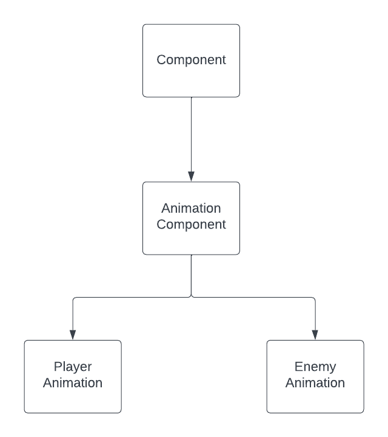

# Don't go outside

## Project Setup 

The project uses git submodules for the following librarys:
* [SFML](https://github.com/SFML/SFML)
* [Box2D](https://github.com/dooglz/Box2D.git)
* [Nlohmann Json](https://github.com/nlohmann/json)

Use this command to get the required librarys `git submodule update --init --recursive`

## Game Design Document 

The Game Design Document can be found [here](gdd.md)

## Video Demo 

The demo of this project can be found [here](https://youtu.be/YKFDQipirEw)

## Fully Functional Game

The game has three levels, a splash screen and a score screen. Each level has its own music and sound effects for elements in the game, more information can be found in the [Game Desgin Document](gdd.md)

## Game Components

Here is a list of components that I created for this game: 

* [Animation Component](src/components/cmp_animation.h)
* [Button Component](src/components/cmp_button.h)
* [Coin Component](src/components/cmp_coin.h)
* [Door Component](src/components/cmp_door.h)
* [Enemy Component](src/components/cmp_enemy.h)
* [Enemy Animation Component](src/components/cmp_enemy_animation.h)
* [HUD Component](src/components/cmp_hud.h)
* [Interaction Component](src/components/cmp_interaction.h)
* [Lever Component](src/components/cmp_lever.h)
* [Music Compoenent](src/components/cmp_music.h)
* [Pickup Component](src/components/cmp_pickup.h)
* [Player Component](src/components/cmp_player.h)
* [Player Animation Component](src/components/cmp_player_animation.h)
* [Sound Component](src/components/cmp_sound.h)

Here is a list of components that were modified:

* [Enemy AI Component](src/components/cmp_enemy_ai.h)
* [Text Component](src/components/cmp_text.h)

### Component OOP Diagram

### Complex Components

Complex components are components that when added to an entity, will add other components to that entity.

* [Coin Component](src/components/cmp_coin.h)
    * [Pickup Component](src/components/cmp_pickup.h)
    * [Sprite Component](src/components/cmp_sprite.h)
    * [Sound Component](src/components/cmp_sound.h)

* [Door Component](src/components/cmp_door.h)
    * [Sprite Component](src/components/cmp_sprite.h)

* [Lever Component](src/components/cmp_lever.h)
    * [Sprite Component](src/components/cmp_sprite.h)
    * [Interaction Component](src/components/cmp_interaction.h)
    * [Animation Component](src/components/cmp_animation.h)
    * [Sound Component](src/components/cmp_sound.h)

    
* [Player Component](src/components/cmp_player.h)
    * [Sprite Component](src/components/cmp_sprite.h)
    * [Player Physics Component](src/components/cmp_player_physics.h)
    * [Player Animation Component](src/components/cmp_player_animation.h)

* [Enemy Component](src/components/cmp_enemy.h)
   * [Sprite Component](src/components/cmp_sprite.h)
   * [Enemy AI Component](src/components/cmp_enemy_ai.h)
   * [Enemy Animation Component](src/components/cmp_enemy_animation.h)

## AI Components

[Enemy AI Component](src/components/cmp_enemy_ai.h) is a simple AI component where the AI follows waypoints it has been given. 

## Memory Management

The project uses smart pointers for memory management.

## Management of Game Resourses

The project uses the resource management system that is in the [Engine](lib/engine/system_resources.h) Library. 

## Additional Libraries

[Nlohmann Json](https://github.com/nlohmann/json) library was added to the project for reading Json files.

## Advanced C++

Through out the project smart pointers are used. 

## Data Driven Functionality

The infomation that are stored in Json files are:

* Level Maps
   * [Level One](res/levels/levelOne/levelOne_V3.json)
   * [Level Two](res/levels/levelTwo/levelTwo_V8.json)
   * [Level Three](res/levels/levelThree/levelThree_V1.json)
* [Enemies Spawnpoints](res/levels/enemies_spawnpoint.json)
* [Collison Tiles](res/img/tile_colision.json)
* [Animations](res/img/anim.json)

## Sounds and Music

Each level and menu has its own music and there are sounds effects for actions in the game. More information in the [Game Design Document](gdd.md)

## Physics Library

The project uses Box2D as its physics engine.

## Managment of the Project

The project used a Trello board to keep track of tasks. The kanban board can be found [here](https://trello.com/b/PRLCNsB6/advance-c)